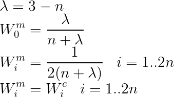

### Notes:

The unscented transform takes points sampled from some arbitary probability distribution, passes them through an arbitrary, nonlinear function and produces a Gaussian for each transformed points. 

#### Sigma Points Augmentation

|            | Sigma Points   |Augmented Sigma points |
|---         |---                  |---              |
| State      |  (2n + 1,   n )     | (2n\_a + 1, n_a)  |       
| Process    |  (2n + 1,   n )     | (2n\_a + 1, n  )  | 
| Measurement|  (2n + 1,   n\_z)   | (2n\_a + 1, n_z) |


#### Weights and Sigma Points

The calculation of the weights is implemented as in the following function:

```
def calculate_weights(self):
        """
        Calculate the weights associated with sigma points. The weights depend on parameters dim_x, aplha, beta, 
        and gamma. The number of sigma points required is 2 * dim_x + 1
        """
        # dimension for detemining the number of sigma points generated
        dim = self.dim_x if not self.augmentation else self.dim_xa
        if self.sigma_mode == 1:
            lambda_ = self.alpha_**2 * (dim + self.kappa_) - dim
            Wc = np.full(2*dim + 1,  1. / (2*(dim + lambda_))) # 
            Wm = np.full(2*dim + 1,  1. / (2*(dim + lambda_)))
            Wc[0] = lambda_ / (dim + lambda_) + (1. - self.alpha_**2 + self.beta_)
            Wm[0] = lambda_ / (dim + lambda_)
        elif self.sigma_mode == 2:
            lambda_ = 3 - dim
            Wc = np.full(2*dim + 1, 1./ (2*(dim + lambda_)))
            Wm = np.full(2*dim + 1, 1./ (2*(dim + lambda_)))
            Wc[0], Wm[0] = lambda_ /(dim + lambda_), lambda_ /(dim + lambda_)
        
        return (Wc, Wm)

```
Here we consider two approaches (modes). In Mode 1, /lambda not only depends on the dimension of the state (or augmented state), but also on parameters such as /alpha and /kappa. Weights for mean and covariance matrix are calculated (slight) differently. 


In Mode 2, /lambda depends only on the dimension. In addition, the weights for mean and covariance are the same.  




The Sigma points are calculated as the following:


The augmented Sigma points are calculated as the following:


The `update_sigma_pts` calculated the Sigma points or augmented  Sigma points

```
def update_sigma_pts(self):
        """
        Create (update) Sigma points during the prediction stage
        """
        if not self.augmentation:
            dim, x, P = self.dim_x, self.x, self.P
        else:
            dim = self.dim_xa
            x = np.concatenate([self.x, self.xa])
            P = block_diag(self.P, self.Qa)
        if self.sigma_mode == 1:    
            lambda_ = self.alpha_**2 * (dim + self.kappa_) - dim
        elif self.sigma_mode == 2:
            lambda_ = 3 - dim
        U = cholesky((dim + lambda_) * P) 
        self.sigma_pts[0] = x
        for k in range (dim):
            self.sigma_pts[k + 1]  = x + U[k]
            self.sigma_pts[dim + k + 1] = x - U[k]
```


